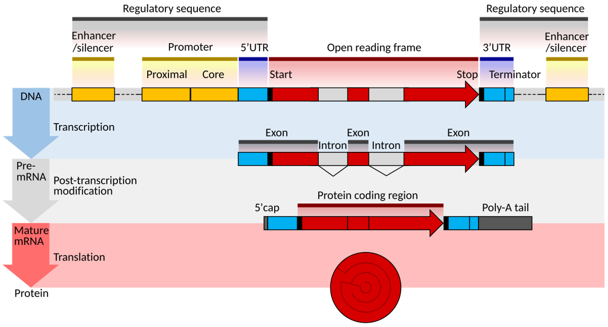

# STR-density
Scripts and background to determine short tandem repeat (STR) densities in genes and genomes

## Background 
### The structure of a (eukaryotic) gene
Genes contain the information necessary for living cells to create proteins.
Read [this wikiversity article](https://en.wikiversity.org/wiki/WikiJournal_of_Medicine/Eukaryotic_and_prokaryotic_gene_structure) to find out more about how genes are made up of exons, introns, and more.

There are around 20'000 protein coding genes in the human genome.
What may be surprising is that there are many more proteins than there are genes, with estimates of the number of human proteins ranging between 80'000 and 400'000.
This means that a single gene has to be able to produce several different protein products.
This is possible through a process known as alternative splicing.
The different protein products generated from the same gene are known as isoforms.
[Wikipedia](https://en.wikipedia.org/wiki/Alternative_splicing) has a good overview of alternative splicing.

### Short tandem repeats
Short tandem repeats (STRs) are consecutive repetitions of 1-6 basepair (bp) motifs. 
They are estimated to make up around 3% of the human genome. Below is an example STR locus:  

  

STRs are a rich source of genomic variation, with some loci having mutation rates up to a 10000 times higher than point mutations. 
STR mutations are typically the result of DNA polymerase slippage during replication, where strand misalignment after polymerase detachment results in the insertion or deletion of one or more repeat units at an STR locus:  

For more background on STRs, the way they mutate, and why they are relevant, you can have a look at our recent review: [Mutation and selection processes regulating short tandem repeats give rise to genetic and phenotypic diversity across species](https://onlinelibrary.wiley.com/doi/full/10.1111/jeb.14106) (there's also a pdf in the [literature](literature) folder).

## Project goal
We are interested in determining whether the evolutionary age of genes (where they first emerged in the tree of life) has a relationship to the number of STR loci. 
Specifically, the goal of this project is to write software that calculates the number and density of STRs in genes. 
This would provide clues to understanding the mechanisms behind how genes emerge.
Ideally, the software should provide specific statistics for intronic, exonic, and/or coding regions.

In order to write software to do this, it is important to understand how genetic data is represented computationally, and how we can work with such data. 
The most important formats to be aware of initially are [FASTA](https://www.ncbi.nlm.nih.gov/genbank/fastaformat/), [BED](https://samtools.github.io/hts-specs/BEDv1.pdf), and [GFF/GTF](https://www.gencodegenes.org/pages/data_format.html). 
For each of these, different libraries exist that can be used to parse them.

## Useful tools and libraries
### General
* [GitHub](https://github.com/): 
Source control is critical in any non-trivial project.
* [miniconda](https://docs.anaconda.com/miniconda/): 
Super useful for managing and separating work environments. 
Is used mainly for setting up Python environments, but can also be used for R.
* [bedtools](https://bedtools.readthedocs.io/en/latest/index.html): 
"...a swiss-army knife of tools for a wide-range of genomics analysis tasks.". 
Useful command line tools for working with bed files, fasta files, etc.
### Python
* [Biopython](https://biopython.org/): 
Library for biological computation in Python. 
The [SeqIO](https://biopython.org/wiki/SeqIO) module can be useful to read and write sequences (fasta, fastq, etc.), although I tend to prefer pysam these days (see below).
* [pysam](https://niyunyun-pysam-fork.readthedocs.io/en/latest/api.html):
Python wrapper for the original [htslib](https://github.com/samtools/htslib) C library. 
Focused on reading/writing alignment files, but also supports reading and writing of fasta, vcf, and more.
* [gtftools](http://www.genemine.org/gtftools.php):
Software that can parse GTF files and provides functionality useful for this project.
Importantly, gtftools can merge the exonic regions for different isoforms of a gene.
This will be useful when determining the overlap between STRs, genes, and their exons.
There is a paper describing gtftools in the [literature](literature) folder.